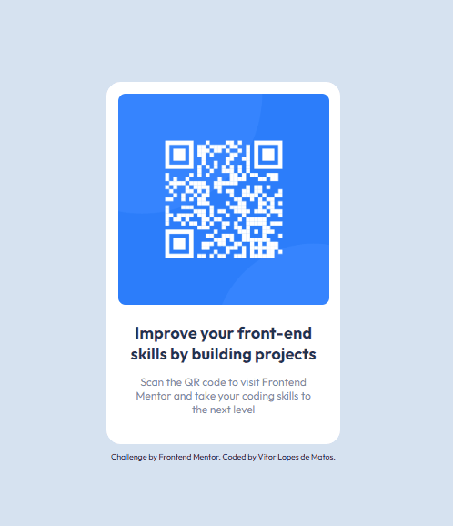

# Frontend Mentor - Solução de componente de código QR

Esta é uma solução para o desafio [componente de código QR no Frontend Mentor](https://www.frontendmentor.io/challenges/qr-code-component-iux_sIO_H). Os desafios do Frontend Mentor ajudam a melhorar suas habilidades de codificação construindo projetos realistas. 

## Visão geral

### O desafio

Os usuários devem ser capazes de:

- Exibir o layout ideal para a página, dependendo do tamanho da tela do dispositivo

### Captura de tela

### Links

- URL da solução: [https://vitorlopes523.github.io/qr-code-component-main/]

## Meu processo

### Construído com

- Marcação semântica HTML5
- Propriedades personalizadas CSS
- Flexbox

### O que eu aprendi

- Largura e altura de elementos dentro de outros elementos.

### Dificuldades

- Pequenas configurações de posicionamento e tamanho de elementos.
- Detalhes de configuração css pela ausência do figma. 

### Desenvolvimento contínuo

- Aprimorar ainda mais conhecimento em HTML e sua semântica.
- Dominar as propriedades de CSS, principalmente flexbox e grid.
- Aprender a base do JavaScript.
- Ter conecimento do JavaScript avançado.
- Aprender e aperfeiçoar o framework React.
- Desenvolver técnicas que melhore meu status como profissional.

### Recursos úteis

- Vídeos do curso DevQuest foram primordias para o desenvolvimento deste projeto.
- Vídeos do canal DevemDobro
(https://www.youtube.com/results?search_query=dev+em+dobro)

## Autor

- Site - [VitorLopesdeMatos](https://vitorlopes523.github.io/MaratonaExplore2/)
- Frontend Mentor - [@vitorlopes523](https://www.frontendmentor.io/profile/vitorlopes523)
- Linkedin - [Vitor Lopes de Matos](https://www.linkedin.com/in/vitor-lopes-de-matos-657261230/)
